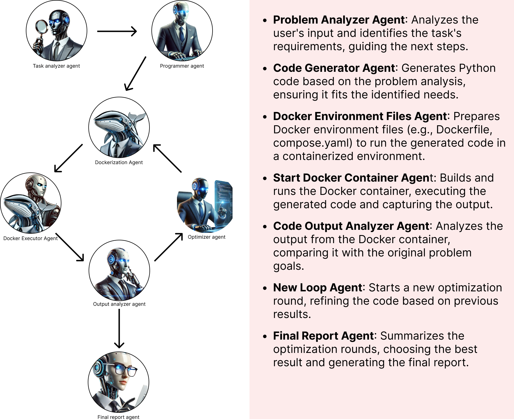

# AI-Agent Powered Code Generation and Optimization

## Introduction
This project showcases the use of AI agents to automate the process of code generation, execution, and iterative optimization. The workflow involves analyzing user input, generating Python code, setting up a Docker environment, executing the code, and performing multiple optimization rounds. The AI agents work together to solve a given problem, optimize the solution through multiple iterations, and generate a final report based on the results.

Each agent in the workflow is responsible for a specific task, from problem analysis to code execution and optimization. The system is built with flexibility, enabling users to refine and improve the generated solutions across multiple rounds of optimizations.

The goal of this project is to demonstrate the capability of language models and AI agents to automate not only the coding process but also the optimization and deployment tasks using Docker. The agents handle the entire lifecycle, ensuring continuous improvement of the generated code until the problem is solved.

This project was developed using Python, integrating the OpenAI API for language model interactions, and utilizing LangChain, LangGraph and Chainlit for agent management and UI.

## Installation

1. start venv -> .\.venv\Scripts\activate
2. install packages -> pip install -r requirements.txt
3. create .env file with own keys for openai
   1. OPENAI_API_KEY
4. run program -> chainlit run main.py

# GPT Lab Seinäjoki

**This project under the GPT Lab Seinäjoki program supports the regional strategy of fostering an innovative ecosystem and advancing smart, skilled development. Its goal is to introduce new AI knowledge and technology to the region, enhance research and innovation activities, and improve business productivity.**

